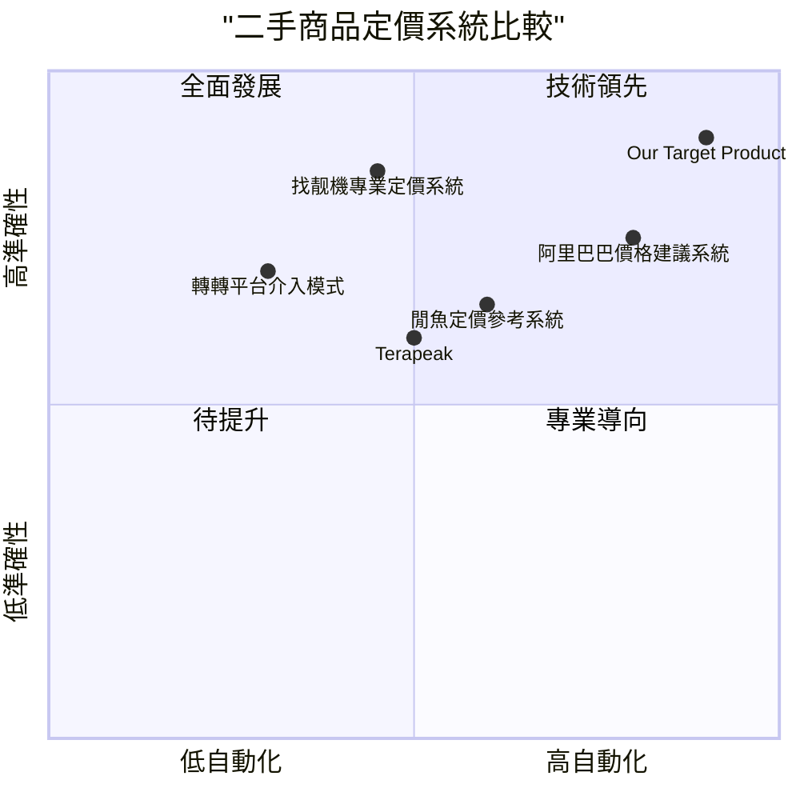

# 產品需求文檔：基於深度強化學習的二手商品動態價格預測系統

## 語言與專案資訊

- 語言：繁體中文
- 程式語言：Python、JavaScript、React
- 專案名稱：second_hand_price_predictor
- 原始需求：開發一個基於深度強化學習的二手商品動態價格預測系統，可以調用eBay的API來動態獲取商品價格。

## 1. 產品定義

### 1.1 產品目標

1. **優化定價決策**：為二手商品賣家提供基於深度強化學習的智能定價建議，提高利潤率和銷售速度。
2. **市場動態掌握**：通過eBay API實時監測相似商品的市場價格走勢，分析供需關係和價格彈性。
3. **簡化賣家決策**：為非專業賣家降低定價難度，使其能夠做出專業化定價決策，減少試錯成本。

### 1.2 用戶故事

1. **作為一名偶爾出售二手商品的賣家**，我希望能夠獲得合理的定價建議，這樣我就能既快速售出商品又不會低估商品價值。

2. **作為一名二手商品專業賣家**，我希望能夠根據市場動態調整我的定價策略，這樣我就能在不同的市場環境下最大化我的利潤。

3. **作為一名電子產品愛好者**，我希望在出售舊設備前了解其合理價值，這樣我就不會因為定價不當而損失金錢。

4. **作為一名二手商品平台營運人員**，我希望能夠為平台用戶提供客觀的價格參考，這樣可以提高平台交易量和用戶滿意度。

### 1.3 競品分析

#### 主要競品

| 產品名稱 | 優勢 | 劣勢 |
|---|---|---|
| 阿里巴巴價格建議系統 | 多模態融合（圖片+文字）、全自動化建議 | 需要高質量數據、針對單一平台優化 |
| 閒魚定價參考系統 | 社區驅動的參考機制、商品相似度比較 | 對冷門商品支持較弱、過度依賴用戶輸入 |
| 轉轉平台介入模式 | 平台質檢提高交易安全、減少爭議 | 人工成本高、擴展性受限 |
| 找靓機專業定價系統 | 垂直領域專業評估、標準化檢測 | 只適用特定品類、跨品類能力弱 |
| Terapeak（eBay數據分析工具） | 直接整合eBay歷史數據、賣家導向 | 無智能定價建議、數據分析需要專業知識 |

#### 競爭象限圖

### 1.4 產品差異化與優勢

1. **跨平台數據整合**：不僅使用eBay API，未來還計劃整合多個二手交易平台的數據，提供更全面的市場視角。

2. **深度強化學習驅動**：相比於僅使用統計方法或簡單機器學習的競品，我們採用深度強化學習能夠更好地捕捉市場動態變化和長期價格趨勢。

3. **個性化定價策略**：根據賣家的不同目標（快速售出vs最高利潤）提供差異化定價策略。

4. **全自動化決策支持**：提供從數據收集、特徵提取到最終定價建議的端到端解決方案。

5. **透明化的決策解釋**：提供模型決策依據的可視化解釋，提高用戶對系統建議的信任度。

## 2. 技術規格

### 2.1 需求分析

#### 功能需求

1. **商品信息獲取**：通過eBay API獲取特定類別二手商品的歷史和當前價格數據
2. **市場分析**：分析相似商品的價格分佈、成交速度和市場趨勢
3. **定價預測**：使用深度強化學習模型預測最佳定價策略
4. **用戶界面**：提供直觀的價格建議和市場分析報告
5. **監控與更新**：持續監控市場變化並更新定價建議

#### 非功能需求

1. **性能**：API數據獲取和分析處理時間不超過5秒
2. **可靠性**：系統可用性應達到99.5%以上
3. **安全性**：所有API密鑰加密存儲，用戶數據需符合數據隱私法規
4. **可擴展性**：系統架構應支持未來整合其他平台API
5. **易用性**：新用戶無需專業知識即可在10分鐘內掌握系統使用

### 2.2 需求池

| ID | 需求描述 | 優先級 | 狀態 |
|---|---|---|---|
| F-001 | 系統必須能夠連接eBay API並獲取商品數據 | P0 | 計劃中 |
| F-002 | 系統必須實現深度強化學習模型進行價格預測 | P0 | 計劃中 |
| F-003 | 系統必須提供用戶友好的Web界面 | P0 | 計劃中 |
| F-004 | 系統應能夠基於類別和特徵識別相似商品 | P0 | 計劃中 |
| F-005 | 系統必須提供價格建議的可視化解釋 | P1 | 計劃中 |
| F-006 | 系統應能根據用戶定義的目標提供定價策略 | P1 | 計劃中 |
| F-007 | 系統應提供定價歷史和效果追蹤功能 | P1 | 計劃中 |
| F-008 | 系統可以支持批量商品分析和定價 | P2 | 計劃中 |
| F-009 | 系統可以提供API接口供第三方調用 | P2 | 計劃中 |
| NF-001 | API數據獲取和分析處理時間不超過5秒 | P1 | 計劃中 |
| NF-002 | 系統可用性應達到99.5%以上 | P1 | 計劃中 |

### 2.3 系統架構

#### 2.3.1 總體架構

系統採用前後端分離架構：

1. **前端**：React框架構建的Web應用
2. **後端**：Python Flask API服務
3. **AI模型**：深度強化學習模型（基於TensorFlow或PyTorch）
4. **數據存儲**：MongoDB用於非結構化數據，MySQL用於結構化數據
5. **第三方集成**：eBay API連接模組

#### 2.3.2 數據流程

1. 通過eBay API採集歷史和當前市場數據
2. 數據預處理和特徵工程
3. 深度強化學習模型訓練和更新
4. 為用戶輸入的商品生成定價建議
5. 收集用戶反饋以改進模型

### 2.4 UI設計草案

#### 2.4.1 主要界面設計

**首頁/儀表板**
- 概覽統計資訊（分析商品數量、平均定價精確度等）
- 快速商品添加入口
- 最近定價分析結果

**商品分析頁面**
- 商品資訊輸入表單（類別、品牌、型號、成色等）
- 上傳商品圖片功能
- 相似商品市場價格分佈圖
- 定價建議及理由解釋
- 不同銷售策略下的價格選項（快速售出、最大化利潤、平衡策略）

**歷史記錄頁面**
- 歷史定價分析結果列表
- 定價效果跟蹤（已售出商品的實際價格vs建議價格）
- 市場趨勢分析圖表

**設置頁面**
- eBay API認證管理
- 用戶偏好設定
- 通知設置

## 3. 實施計劃

### 3.1 技術堆疊

- **前端**：React, Tailwind CSS, Chart.js
- **後端**：Python, Flask, RESTful API
- **AI框架**：TensorFlow/PyTorch, OpenAI Gym（強化學習環境）
- **數據庫**：MongoDB, MySQL
- **部署**：Docker, AWS/GCP
- **第三方API**：eBay API

### 3.2 實施階段

#### 階段一：API整合與數據收集（估計4週）

- 完成eBay API整合
- 建立數據收集與儲存框架
- 實現基本數據分析功能

#### 階段二：AI模型開發（估計6週）

- 特徵工程與數據預處理
- 基本ML模型開發（基線模型）
- 深度強化學習模型設計與訓練
- 模型評估與優化

#### 階段三：前後端開發（估計5週）

- 後端API開發
- 前端用戶界面實現
- 系統整合與測試

#### 階段四：測試與優化（估計3週）

- 功能測試與性能優化
- 用戶體驗測試與改進
- 模型微調與系統穩定性提升

## 4. 開放問題與風險

### 4.1 開放問題

1. **數據有效性**：如何確保從eBay獲取的數據量足以訓練有效的深度強化學習模型？
2. **模型評估標準**：如何確定定價建議的準確性和有效性？
3. **市場變化適應**：模型如何快速適應市場突發變化（如新品發布帶來的價格波動）？
4. **不同商品類別的處理**：不同類別的二手商品定價特徵差異很大，如何設計通用的模型架構？

### 4.2 風險與緩解策略

| 風險 | 影響程度 | 可能性 | 緩解策略 |
|---|---|---|---|
| eBay API限制與變更 | 高 | 中 | 建立API使用監控系統，開發備用數據獲取方案，與eBay開發者社區保持聯繫 |
| 深度強化學習模型性能不達預期 | 高 | 中 | 並行發展基於統計方法的備用模型，逐步優化強化學習方法 |
| 用戶接受度不足 | 中 | 中 | 提高模型透明度，提供決策依據解釋，增加用戶實際收益案例展示 |
| 數據質量問題 | 高 | 高 | 實施嚴格的數據清洗流程，開發異常檢測機制，保證訓練數據質量 |
| 計算資源需求超出預期 | 中 | 低 | 優化模型架構，使用增量學習方法，靈活擴展雲計算資源 |

## 5. 成功指標

### 5.1 技術指標

- 定價建議準確度：與實際成交價格偏差不超過10%
- 系統響應時間：商品分析和定價建議生成時間不超過5秒
- 模型更新頻率：每週至少一次市場數據更新和模型參數調整

### 5.2 業務指標

- 用戶採納率：用戶接受系統定價建議的比例達到70%以上
- 用戶滿意度：系統使用滿意度評分4.5/5以上
- 銷售效率提升：使用系統後，商品平均銷售時間縮短25%
- 利潤提升：使用系統後，用戶平均利潤增加15%

## 6. 未來拓展

- **多平台整合**：擴展至其他二手交易平台（如Amazon、蝦皮、淘寶等）
- **更多商品類別支持**：擴展到更多專業領域（如收藏品、藝術品等）
- **移動端應用**：開發iOS和Android原生應用
- **社區功能**：建立用戶社區分享定價經驗和策略
- **高級分析功能**：提供更深入的市場趨勢和季節性分析
- **批量定價API**：為專業賣家和企業提供批量商品定價API服務